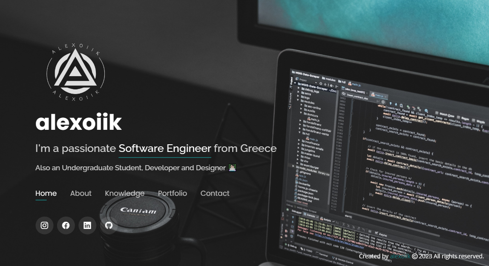

# alexoiik.github.io

> ### Website

> ### Content Info

- Languages used: HTML, CSS and JavaScript.
- This website designed with the help of [BootstrapMade](https://bootstrapmade.com/) (using Personal v5.3.1 template).
- Using the simple permissive license of [MIT](LICENSE).
- Project's rights under the [BootstrapMade license information](https://bootstrapmade.com/license/).
- Template used &amp; edited by me according to my needs, with the aim of creating my personal website.
